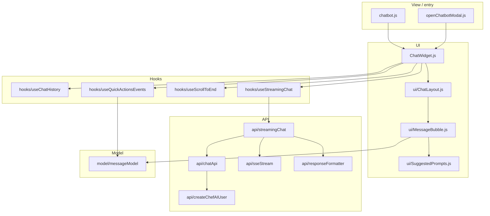
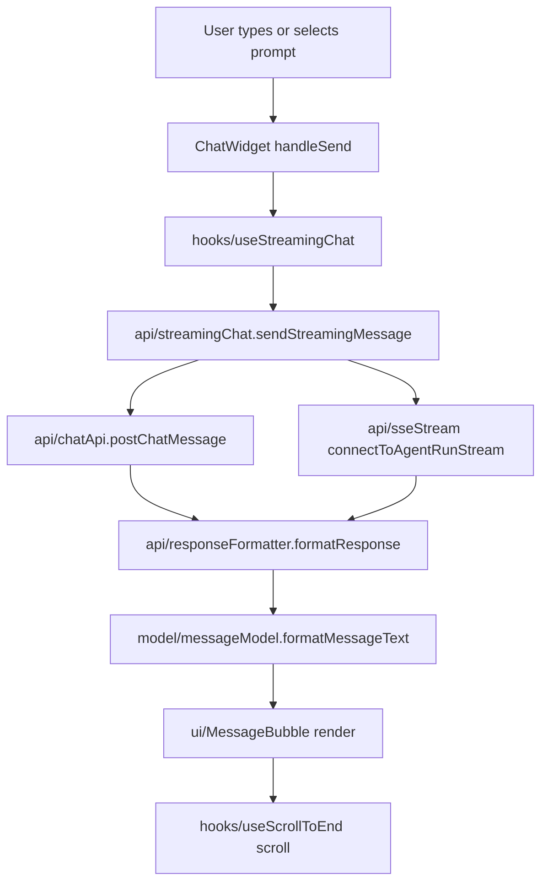

## ChefAI Chatbot helpers

This folder contains the shared helpers and React UI used to render the ChefAI chatbot inline on content pages and inside modals and the personalised hub.

The code is organised into clear layers so the team can quickly find API calls, hooks, UI, and message formatting logic.

### Folder structure

- **`chatbot.js`**: AEM block entry that mounts the inline chatbot, loads `ui/chatbot.css`, resolves the endpoint via `getMetadata`, and lazy‑loads `ChatWidget`.
- **`openChatbotModal.js`**: Opens the same `ChatWidget` in a modal overlay with its own container and close lifecycle.
- **`ChatWidget.js`**: Main widget composition file; wires hooks (`useChatHistory`, `useStreamingChat`, `useScrollToEnd`, `useQuickActionsEvents`) and passes data to the UI layout.
- **`api/`**:
  - `chatApi.js`: Endpoint selection (`setEndpoint` / `getEndpoint`), user/thread resolution, and `postChatMessage` with timeout support.
  - `streamingChat.js`: High‑level SSE orchestration (`sendStreamingMessage`) that combines `chatApi`, `sseStream`, and `responseFormatter`.
  - `sseStream.js`: Low‑level SSE client based on `fetch` and `ReadableStream`.
  - `responseFormatter.js`: Maps raw API responses into internal `ChatMessage` objects and collects images, recipes, products, and suggested prompts into `metadata`.
  - `createChefAIUser.js`: Helper for creating ChefAI users from other parts of the site.
- **`hooks/`**:
  - `useChatHistory.js`: Loads cached and remote history, validates/creates threads, merges quick‑action headlines, and persists chat history.
  - `useStreamingChat.js`: Manages message sending, SSE connection lifecycle, placeholder AI message, errors, and personalised‑hub trigger behaviour.
  - `useScrollToEnd.js`: Keeps the chat scrolled to the most recent message and controls the mobile “scroll to bottom” button.
  - `useQuickActionsEvents.js`: Listens for `chefai:quick-action` and `chefai:insights` events and injects headline messages using the shared message model.
- **`ui/`**:
  - `ChatLayout.js`: Stateless layout built with `window.React.createElement`; renders the message list, `ChatInput`, error banner, and scroll button.
  - `MessageBubble.js`: Message renderer responsible for text, images, recipes and recipe details, in‑message product carousel, timestamps, and suggested prompts.
  - `SuggestedPrompts.js`: Reusable chip list of suggested prompts.
  - `chatbot.css`: All visual styling for the inline and modal chatbot, including message bubbles and in‑message carousels.
- **`model/`**:
  - `messageModel.js`: Canonical message model utilities:
    - `USER_ID` / `AI_ID` constants used across widgets.
    - `formatMessageText(rawText)` which uses `window.marked` and `window.DOMPurify.sanitize` when available, falling back to safe escaping.
    - `buildHeadlineMessage({ threadId, headlineText, createdAt, type })` used by history and quick‑action flows.

All files in this folder contain real logic; there are no wrapper‑only modules that just re‑export from other files.

### Architecture overview

### Message and data flow

Messages from the backend (including recipes, recipe_details, products, images, and suggested prompts) are normalised in `responseFormatter.js` and attached as `metadata` on each `ChatMessage`. The UI reads only from this model and runs text content through `formatMessageText`, ensuring any HTML is generated from markdown and sanitised with `DOMPurify` before being injected into the DOM.

